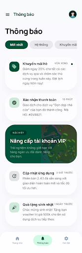
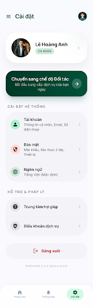

# Mobile UI Design Specification - Sàn Dịch Vụ

This document specifies the mobile interface design (iPhone 15 Pro / iOS 17 style) for the "Sàn Dịch Vụ" platform, following the "Translucent Editorial" and "Emerald Horizon" design systems.

## 1. Design Principles
- **Editorial Fluidity**: Focused on whitespace, bold Manrope typography, and Inter body text.
- **Glassmorphism**: 20px-30px Backdrop Blur on headers and bottom sheets.
- **Organic Shapes**: 32px (`xl`) or 48px corner radii for all high-level containers.
- **Tonal Contrast**: No 1px borders. Use background color shifts (`surface_container_low` vs `surface`) to define boundaries.
- **Interactions**:
    - **Pull-to-refresh**: Integrated for all lists fetching data via `GET`.
    - **Bottom Sheets**: Used for high-impact actions like "Logout confirmation" or "Post submission".

---

## 2. Screen Previews & API Mapping

### 2.1. Entry Flow (Splash & Auth)

#### Splash Screen

- **Logic**: Initial brand immersion and session check.
- **API**: `GET /api/v1/common/me` for recovery.

#### Login Screen (Đăng nhập)

- **Interaction**: Clean editorial inputs with 24px radius.
- **API**: `POST /api/v1/auth/login/password`.

#### Register Screen (Đăng ký)

- **Interaction**: Two-step flow integrated into one clean view.
- **API**: `POST /api/v1/auth/register`.

#### OTP Verification (Xác minh)

- **Interaction**: 6-digit discrete entry fields. Resend timer (60s).
- **API**: `POST /api/v1/auth/otp/verify`.

---

### 2.2. Home Screen (Trang chủ)

| UI Component | Data Source (Backend API) | Interaction |
|--------------|---------------------------|-------------|
| **Promo/News Feed** | `GET /api/v1/common/posts` | Tapping reads the full article. |
| **System Updates** | (Implied/Future Order updates) | Pull-to-refresh to sync. |

### 2.3. Discovery & Search (Khám phá)

#### Category Browser (Trình duyệt dịch vụ)

| UI Component | Data Source (Backend API) | Interaction |
|--------------|---------------------------|-------------|
| **Industry Pillars** | `GET /api/v1/customer/industry-categories` | Horizontal scroll of high-level categories. |
| **Service Grid** | `GET /api/v1/customer/categories/{slug}` | 2-column grid of sub-categories with 48px radius. |

#### Search Results (Kết quả tìm kiếm)

| UI Component | Data Source (Backend API) | Interaction |
|--------------|---------------------------|-------------|
| **AI Search Bar** | `GET /api/v1/customer/search` | Natural language query support. |
| **Provider Cards** | `GET /api/v1/customer/search` | 40px radius cards with Rating, Jobs count, and Bio. |
| **Filters** | Client-side / API query params | Quick filter chips: "Rating", "Distance", "Price". |

### 2.4. Provider Details (Chi tiết nhà cung cấp)

| UI Component | Data Source (Backend API) | Interaction |
|--------------|---------------------------|-------------|
| **Expertise Tags** | `GET /api/v1/customer/providers/{id}` | Highlights specific skills of the partner. |
| **Trust Metrics** | `GET /api/v1/customer/providers/{id}` | Verification badge and success history. |
| **Contact Action** | Phone/WhatsApp Link | Floating Action Button (FAB) for immediate connection. |

### 2.5. Partner Workspace (Dành cho thợ)

#### Partner Dashboard

| UI Component | Data Source (Backend API) | Interaction |
|--------------|---------------------------|-------------|
| **Status Toggle** | `PUT /api/v1/provider/profile` | Switch between "Online" (Ready) and "Offline". |
| **Success Stats** | `GET /api/v1/provider/profile` | Summary of completed jobs and current ratings. |

#### Service Management (Đăng ký dịch vụ)

| UI Component | Data Source (Backend API) | Interaction |
|--------------|---------------------------|-------------|
| **Owned Services** | `GET /api/v1/provider/services` | List of current offerings. |
| **Add New Service** | `POST /api/v1/provider/services` | Wizard/Form with 48px radio buttons/inputs. |
| **Attributes** | `POST /api/v1/provider/service-attributes` | Detailed skill-level tagging. |

### 2.6. Settings & Profile Screen (Cài đặt)

| UI Component | Data Source (Backend API) | Interaction |
|--------------|---------------------------|-------------|
| **User Profile Card** | `GET /api/v1/common/me` | Displays name, avatar, and role. |
| **Account Info** | `PUT /api/v1/common/me` | Edit personal details. |
| **Switch to Partner** | `GET /api/v1/common/me/roles` | Toggles UI to Provider Workspace. |
| **Logout Button** | `POST /api/v1/auth/logout` | Triggers confirmation Bottom Sheet. |

---

## 3. Interaction Specifications

### Pull to Refresh
- **Behavior**: Overscrolling a list triggers a fluid iOS-style "spring" indicator.
- **Logic**: Re-requests the corresponding `GET` endpoint and replaces the local cache.

### Bottom Sheets
- **Usage**: logout confirmation, filter selection, and form inputs.
- **Style**: 40% height, massive **48px** top-corner radius, background blur (25px).

---

## 4. Color Palette
- **Primary**: #00523b (Deep Forest Green)
- **Background**: #f9f9fe (Crisp Surface)
- **Container**: #f3f3f8 (Secondary Tonal Shift)
