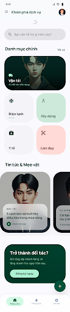

# Mobile UI Design Specification - Sàn Dịch Vụ

This document specifies the mobile interface design (iPhone 15 Pro / iOS 17 style) for the "Sàn Dịch Vụ" platform, following the "Translucent Editorial" and "Emerald Horizon" design systems.

## 1. Design Principles
- **Editorial Fluidity**: Focused on whitespace, bold Manrope typography, and Inter body text.
- **Glassmorphism**: 20px-30px Backdrop Blur on headers and bottom sheets.
- **Organic Shapes**: 32px (`xl`) or 48px corner radii for all high-level containers.
- **Tonal Contrast**: No 1px borders. Use background color shifts (`surface_container_low` vs `surface`) to define boundaries.
- **Interactions**:
    - **Pull-to-refresh**: Integrated for all lists fetching data via `GET`.
    - **Bottom Sheets**: Used for high-impact actions like "Logout confirmation" or "Post submission".

---

## 2. Screen Previews & API Mapping

### 2.1. Home Screen (Trang chủ)

| UI Component | Data Source (Backend API) | Interaction |
|--------------|---------------------------|-------------|
| **Industry Categories** | `GET /customer/industry-categories` | Tap to drill down to services. |
| **News & Tips Cards** | `GET /common/posts` | Horizontal scroll. |
| **Search Bar** | `GET /customer/providers` | Direct entry to search tab. |
| **Global View** | `GET /health` | Initial availability check. |

### 2.2. Notifications Screen (Thông báo)

| UI Component | Data Source (Backend API) | Interaction |
|--------------|---------------------------|-------------|
| **Promo/News Feed** | `GET /common/posts` | Tapping reads the full article. |
| **System Updates** | (Implied/Future Order updates) | Pull-to-refresh to sync. |

### 2.3. Settings & Profile Screen (Cài đặt)

| UI Component | Data Source (Backend API) | Interaction |
|--------------|---------------------------|-------------|
| **User Profile Card** | `GET /api/v1/common/me` | Displays name, avatar, and role. |
| **Account Info** | `PUT /api/v1/common/me` | Edit personal details. |
| **Switch to Partner** | `GET /api/v1/common/me/roles` | Toggles UI to Provider Workspace. |
| **Logout Button** | `POST /api/v1/auth/logout` | Triggers confirmation Bottom Sheet. |

---

## 3. Interaction Specifications

### Pull to Refresh
- **Behavior**: Overscrolling a list triggers a fluid iOS-style "spring" indicator.
- **Logic**: Re-requests the corresponding `GET` endpoint and replaces the local cache.

### Bottom Sheets
- **Usage**: logout confirmation, filter selection, and form inputs.
- **Style**: 40% height, massive **48px** top-corner radius, background blur (25px).

---

## 4. Color Palette
- **Primary**: #00523b (Deep Forest Green)
- **Background**: #f9f9fe (Crisp Surface)
- **Container**: #f3f3f8 (Secondary Tonal Shift)
